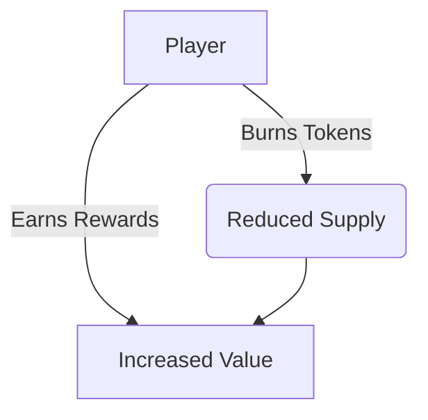
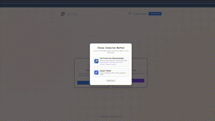

# 🐾 PetWorld - A Revolutionary Economic Model

## 🌟 Introduction

PetWorld is an **innovative gaming platform** designed to test a **groundbreaking economic model** in a fun and engaging way. Unlike traditional models that reduce token emissions over time, our system implements:

- 🚀 **Triple-deflationary mechanism**
- 🔥 **Reward-based reverse burning system**
- 🎮 **Gamified participation**

## 🎯 Key Features

### 💎 Innovative Economic Model
| Feature | Description |
|---------|-------------|
| **Triple-Deflation** | Three-layer token reduction mechanism |
| **Reverse Burning** | Players earn by reducing supply |
| **Burn-to-Earn** | Strategic burning maximizes rewards |

### ⛓️ Decentralized Participation
🔒 All operations are executed through **audited smart contracts** ensuring:
- Transparency
- Security
- Immutability

### 🎮 Dual Participation Methods

### 1. NFT Pet System (Play-to-Earn)

🐾 **Core Mechanics**:
- Adopt and nurture pets (NFTs) that grow stronger over time
- Earn points through daily feeding and care activities
- Pets level up based on feeding duration (1-5 levels)

📈 **Reward Structure**:

| Level | Multiplier |
|-------|------------|
| 1     | 1x         |
| 2     | 2x         |
| 3     | 3x         |
| 4     | 4x         |
| 5     | 5x         |

### 2. Stablecoin Staking (Secure Earnings)

💰 **How It Works**:
- Deposit supported stablecoins into non-custodial smart contracts

🔒 **Security Features**:
- 100% self-custody (only you control withdrawals)
- Audited smart contracts
- Real-time transparency on blockchain

### ✨ Bonus: Referral System

🤝 **Earn Together**:
1. Invite friends
2. Permanent partnership - keep earning from their activity

### 🎯 Two Modes for All Players

**Game Mode** 🕹️
- Full interactive experience
- Visual pet evolution
- Marketplace for NFT trading

**Simple Mode** ⚡
- Streamlined interface
- Quick actions for:
  - Burning points
  - Staking
  - Claiming rewards

## 🎮 Gameplay Examples

Here are some examples of the Petworld game in action:

### Game Scene

See the main game environment and your pets:

### Providing Your Key

Learn how to provide your key when entering the game:

### Feeding and Claiming Rewards

Watch how to feed your pets and claim your rewards:

## 🛡️ Security & Transparency

✔️ Fully decentralized execution
✔️ All operations on-chain
✔️ Open-source verification (GPL 3.0)

## 🚀 Getting Started

### Prerequisites
- Node.js v16+ [(Download)](https://nodejs.org/en/download/)

### Installation
1. Download the latest release from our [GitHub Releases](https://github.com/yourusername/petworld/releases) page
2. Extract the ZIP file
3. For Windows: Run `WIN_START.bat`
4. For macOS/Linux: Run `MAC_START.sh`

Or visit our [Official Website](https://www.petworldfun.com/) for alternative download options.

### Platform Support
| OS | Status |
|----|--------|
| Windows | ✅ Fully Supported |
| macOS | ✅ Fully Supported |
| Linux | ✅ Fully Supported |

## 🤝 Community & Contribution

We welcome contributions!

### Customization Guide
1. Fork the repository
2. Create your feature branch
3. Commit your changes
4. Push to the branch
5. Open a pull request

## 📜 License

This project is licensed under the **GPL 3.0 License** - see the [LICENSE](LICENSE) file for details.

---

